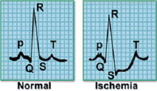

# ECG200 
In these experiments, we import the ECG200 dataset into the Aretas platform, then export the data as image fields with interpolation / scaling. 

One notebook demonstrates using untrained ResNet architecture and the other a Vision Transformer. Both perform well on this severely unbalanced dataset.

For both experiments, we are encoding the ECG200 dataset as gramian image fields and train the models on train/valid split and an unseen test set. With very little optimization, we're able to acheive a 90% accuracy on the test/training split and 83% accuracy on previously unseen images. 

The train and test sets both contain 100 items each with ~64% normal ECGs (indicating normal heartbeat) and ~35% ECGs indicating myocardial infarction. 

Unfortunately, with this class imbalance it's difficult to train adequately. Normally, we split off 20% of the original dataset for unseen testing. 35% of 200 is 70 samples for ECGs indicating myocardial infarction. We split off 20% (14) for unseen testing and we're left with 56 images for train/validation. Then, for train/validation we only have roughly 45/11 train/valid images. Augmentation has helped in other tasks (such as the Olive Oil spectroscopy image field experiment) but we're not augmenting this set. 

We are exporting the data from the Aretas platform using the GADF, batch normalization, 2.5x interpolation and vision color palette.
